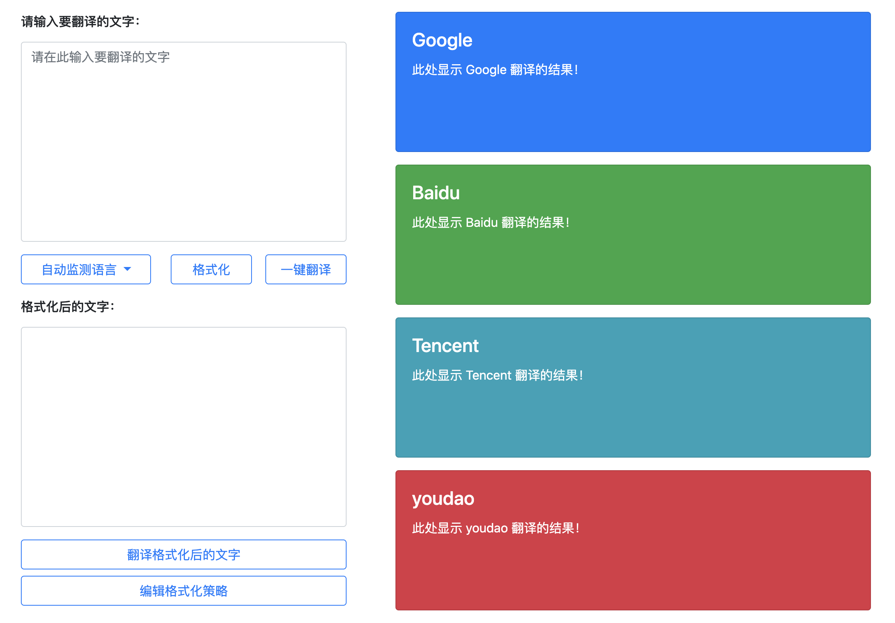
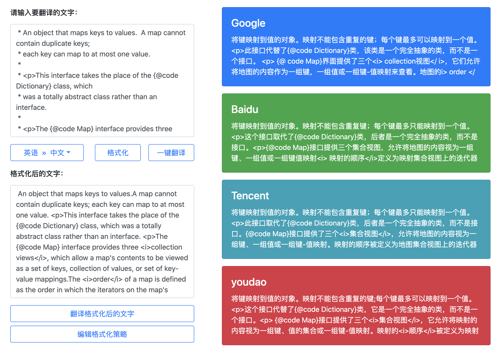
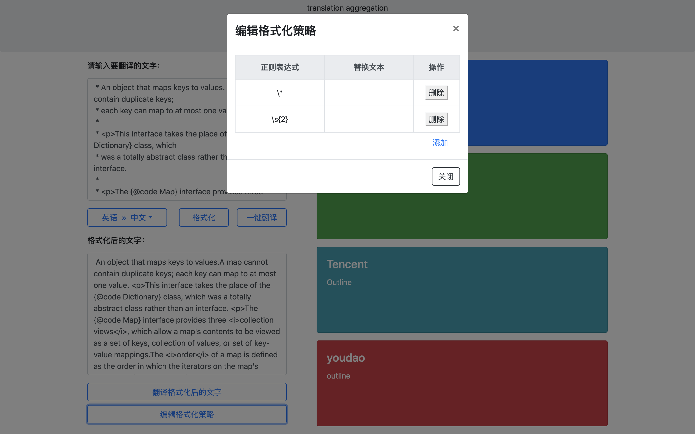
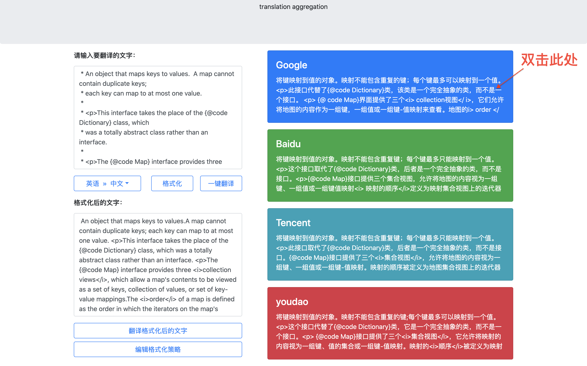

## 翻译聚合

本仓库实现了一个聚合了主流翻译工具（**谷歌翻译**、**有道翻译**、**百度翻译**、**腾讯翻译**）的桌面级应用。

本仓库的开发基于 [NW.js](https://github.com/nwjs/nw.js)。

## 功能简介

#### 界面


#### 翻译


#### 格式化待翻译的文字


#### 复制翻译结果


## 快速开始

安装环境 [node.js](https://nodejs.org/)

修改 `src/config.json` ，添加自己申请的 key（申请地址：[有道](https://ai.youdao.com/product-fanyi-text.s)、[百度](https://api.fanyi.baidu.com/product/11)、[腾讯](https://ai.qq.com/product/nlptrans.shtml#text)，它们几乎可认为是免费的）。
```json
{
    "googleHost": "translate.google.cn",

    "youdaoAppid": "申请的有道翻译 Appid",
    "youdaoKey": "申请的有道翻译 Key",

    "baiduAppid": "申请的百度翻译 Appid",
    "baiduKey": "申请的百度翻译 Key",

    "tencentSecretId": "申请的腾讯翻译 SecretId",
    "tencentSecretKey": "申请的腾讯翻译 SecretKey",
    "tencentRegion": "ap-beijing"
}
```

安装，在项目目录下执行 `npm install`

调试运行，在项目目录下执行 `npm run dev`

打包，在项目目录下执行 `npm run prod` 。打包成的应用被保存在 `dist/` 文件夹下

## License

[MIT](https://github.com/INotWant/translation-aggregation/blob/master/LICENSE)
